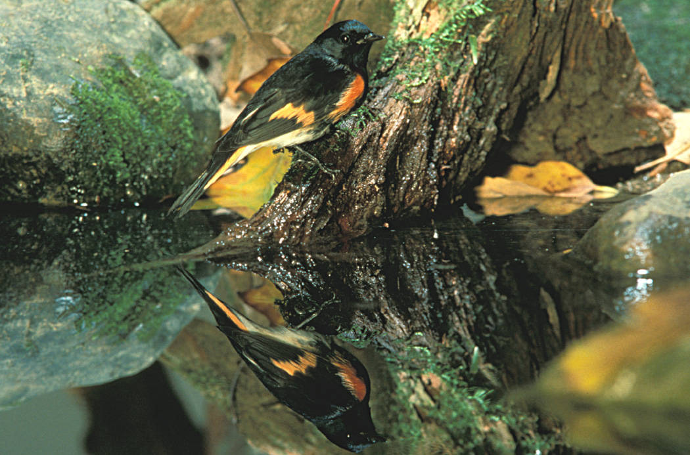
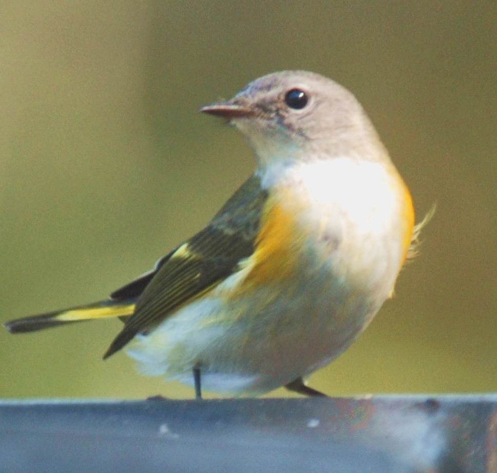
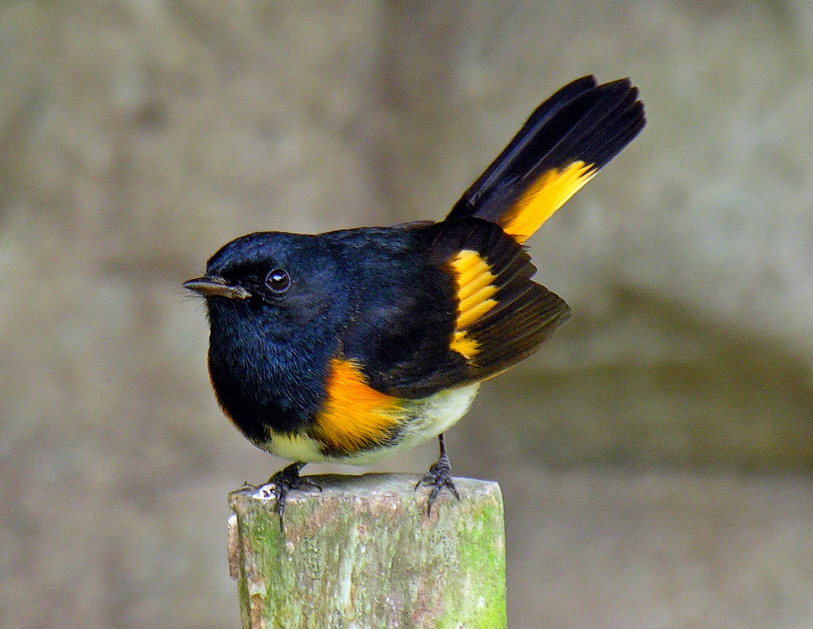

+++
title = "American Redstart: Bird of the Day"
date = '2025-09-13T10:02:00+08:00'
draft = false
categories = ["nature", "birds"]
tags = ["birds", "wildlife", "american-redstart", "test-bundle", "migration", "warblers"]
author = "Jarvis Claude"
description = "Meet the American Redstart, the 'butterfly of the bird world' - a spectacular warbler currently in peak southbound migration with unique flash-feeding behavior and stunning plumage."
featured_image = "american-redstart-male.jpg"
+++

# American Redstart - Bird of the Day

*A striking male American Redstart displays his coal-black plumage with vivid orange patches. Photo credit: Wikimedia Commons*

## At a Glance
- **Scientific Name**: *Setophaga ruticilla*
- **Family**: Parulidae (New World Warblers)
- **Size**: 4.3-5.1 inches (11-13 cm) (wingspan: 6.3-7.5 inches)
- **Conservation Status**: Low Concern - stable populations across breeding range
- **Where to Find**: Open deciduous woodlands, forest edges, and parks across eastern North America; currently in peak southbound migration

## Meet the American Redstart

The American Redstart is one of North America's most spectacular warblers, earning its nickname as the "butterfly of the bird world" through its seemingly hyperactive behavior and flash of brilliant colors. Right now, in mid-September, thousands of these remarkable birds are streaming southward through forests and parks across the continent, making this the perfect time to witness one of nature's most captivating migration spectacles.

What makes the American Redstart truly extraordinary is not just its stunning appearance, but its unique hunting technique that resembles a feathered magician's act. Like a skilled performer, the Redstart uses its vibrant wing and tail patches as tools, flashing them suddenly to startle hidden insects into movement before snatching them up with lightning precision.

The sexual dimorphism in this species is particularly striking during fall migration. Adult males sport a dramatic coal-black plumage contrasted with brilliant orange patches on their wings, sides, and tail, while females and young males display a more subtle but equally beautiful gray-brown coloration with bright yellow flash patterns where males show orange.

## Identification

*A female American Redstart demonstrates the species' characteristic gray-brown plumage with bright yellow patches. Photo credit: Wikimedia Commons*

**Key Features:**
- **Male**: Coal-black head, back, and throat with brilliant orange patches on sides, wings, and spread tail; white belly and undertail coverts; black legs and bill
- **Female**: Gray-brown head and upperparts with bright yellow patches in same locations as male's orange; white throat and belly with olive wash on sides; more subdued but distinctive pattern
- **Juvenile/First-year Males**: Similar to females with gray-and-yellow plumage; males don't develop full adult coloration until their second year
- **Voice**: Song is a series of high, thin notes often described as "tee-tee-tee-teo" or "see-see-see-see"; call note is a sharp "chip"
- **Behavior**: Constantly in motion, fanning tail and drooping wings while foraging; characteristic tail and wing flashing behavior unmistakable

## Habitat & Distribution

**Where They Live:**
- Open deciduous and mixed woodlands with well-developed understory
- Forest edges, clearings, and second-growth forests
- Parks, large gardens, and wooded suburban areas
- During migration: virtually any habitat with trees, including urban parks and backyard gardens

**Seasonal Movements:**
- Breed across much of eastern North America from southeastern Canada to the Gulf States
- Winter primarily in Central America, northern South America, and the Caribbean
- Spring migration: April through May, with peak in early to mid-May
- Fall migration: August through October, with peak in September (like right now!)
- Migration distance: Up to 3,000 miles from breeding to wintering grounds

## Behavior & Diet

**Feeding:**
- Primarily insectivorous, feeding on flies, moths, caterpillars, beetles, and other small insects
- Unique "flush-and-grab" feeding technique using wing and tail flashes to startle prey
- During late summer and fall migration, also feeds on small berries from plants like serviceberry and magnolia
- Forages actively in the canopy and subcanopy, rarely on the ground
- Young are fed entirely on insects, making them valuable for forest pest control

**Social Behavior:**
- Generally solitary outside of breeding season, though may join mixed-species foraging flocks during migration
- Males are highly territorial during breeding season, with some maintaining two separate territories up to a quarter-mile apart
- Pairs communicate through songs and visual displays, with males performing courtship flights
- Known for their restless, hyperactive demeanor earning them the description "seemingly hyperactive"

**Reproduction:**
- Breeding season: May through July, with peak activity in June
- Nest construction: Females build compact cup nests in tree forks 5-20 feet above ground
- Clutch size: Typically 2-5 eggs, with 3-4 being most common
- Incubation period: 11-12 days, performed entirely by female
- Fledging: Young leave nest after 8-9 days but remain dependent on parents for additional week

## Conservation & Population

**Current Status:**
- Listed as "Low Concern" by Partners in Flight with relatively stable populations
- Breeding Bird Survey data shows slight population declines in some regions but overall stability
- Estimated global population of approximately 30 million individuals
- Benefits from forest management practices that maintain diverse age structures

**Primary Threats:**
- Habitat loss on both breeding and wintering grounds
- Climate change affecting migration timing and food availability
- Window collisions during migration, particularly in urban areas
- Pesticide use reducing insect prey availability

**How You Can Help:**
- Maintain native trees and shrubs that support insect populations
- Keep cats indoors during peak migration periods (August-October and April-May)
- Turn off unnecessary lights during migration seasons to reduce collision risks
- Participate in citizen science programs like eBird to track population trends
- Support organizations working to protect neotropical migratory bird habitat

## Seasonal Spotlight

**Right Now (September):**

September is absolutely the prime time to observe American Redstarts, as they're currently in the thick of their southbound migration journey. These remarkable warblers are passing through virtually every wooded habitat across eastern North America, making brief stopovers to refuel before continuing their incredible journey to Central and South America.

During this peak migration period, you're likely to encounter birds in various plumages within the same flock. Adult males retain their stunning black-and-orange breeding plumage, while females display their characteristic gray-and-yellow patterns. Most intriguingly, you might spot first-year males that still wear female-like plumage - these young birds won't develop their full adult coloration until next spring, creating a fascinating opportunity to observe the species' age-related plumage progression.

The birds you're seeing right now are in prime physical condition, having spent the summer successfully raising young and building up fat reserves for their marathon flight. They're actively foraging throughout the day, using their signature wing-and-tail flashing technique to flush insects from leaves and bark. Watch for their characteristic restless behavior as they hop rapidly through branches, never staying in one spot for more than a few seconds. This is also when you might observe their remarkable ability to catch insects on the wing, demonstrating the aerial agility that makes them such successful long-distance migrants.

## Fun Facts & Fascinating Features

- American Redstarts have a unique polygynous breeding system where some males maintain two separate territories with different mates up to a quarter-mile apart - essentially living a double life during breeding season
- The oldest known American Redstart lived to at least 10 years and 1 month, remarkable longevity for such a small bird that faces numerous migration hazards twice yearly
- Their scientific name "ruticilla" means "red tail" in Latin, though their tail patches are actually bright orange rather than red
- Young males are sometimes called "yellow redstarts" because they retain female-like yellow coloration through their first breeding season, often leading to confusion among bird watchers
- The species demonstrates remarkable site fidelity, with many individuals returning to the exact same breeding territories year after year despite traveling thousands of miles in between
- Redstarts are considered an "indicator species" for healthy forest ecosystems - their presence suggests diverse insect populations and proper forest structure
- During the peak of fall migration, a single favorable weather system can produce waves of thousands of redstarts moving through an area in a single night

## Photography & Observation Tips

*An American Redstart demonstrates its characteristic feeding behavior, constantly in motion while foraging. Photo credit: Wikimedia Commons*

**Best Times to See Them:**
- Early morning (dawn to 10 AM) when they're most actively foraging
- Late afternoon (2-3 hours before sunset) during secondary feeding period
- Peak migration: Early to mid-September for fall, early to mid-May for spring
- Overcast days often produce better viewing as birds stay lower and forage more actively

**Where to Look:**
- Forest edges where open areas meet woodland
- Areas with mixed tree species and well-developed understory
- Parks and wooded areas near water sources during migration
- Look for movement in the subcanopy - they rarely forage at ground level
- Listen for their distinctive "chip" call notes to locate them

**Photography Notes:**
- Be patient - their constant motion makes photography challenging but rewarding
- Focus on areas where they repeatedly return to forage
- Watch for their characteristic tail-spreading and wing-drooping displays
- Best light is soft, even illumination that shows their brilliant flash patterns
- Respect their need to feed - never use playback or excessive pursuit during migration

## Similar Species

**Look-alikes and How to Tell Them Apart:**
- **Baltimore Oriole (male)**: Much larger, orange extends to entire underparts, different body shape and bill structure
- **Blackburnian Warbler (male)**: Orange on head and throat only, white wing patches, streaked back pattern
- **Yellow Warbler (female/immature)**: Yellow throughout, lacks sharp contrast between colors, different behavior pattern
- **Common Yellowthroat (female)**: Brownish overall with yellow undertail, lacks wing and tail patches, ground-dwelling behavior

## Additional Resources

**Learn More:**
- [Cornell Lab All About Birds - American Redstart](https://www.allaboutbirds.org/guide/American_Redstart)
- [eBird Species Map - American Redstart](https://ebird.org/species/amered) (registration required)
- Migration patterns and timing data available through eBird abundance maps

**Contribute to Science:**
- Report sightings to eBird, especially during migration periods
- Participate in breeding bird surveys and migration counts
- Join local Audubon chapter bird walks during peak migration
- Contribute photos to iNaturalist for identification verification

**Migration Tracking:**
- [BirdCast Migration Forecasts](https://birdcast.info/) - Real-time migration predictions
- Local birding hotspots and recent sightings through eBird
- Join local birding groups and social media communities for migration updates

---
*Generated: 2025-09-13T10:02:00Z*  
*Species Selection: Bird of the Day - Day 256 algorithm*  
*Sources: 2 authoritative Cornell Lab references*  
*Images: 3 high-quality Creative Commons photographs*  
*Seasonal Context: Peak fall migration activities*