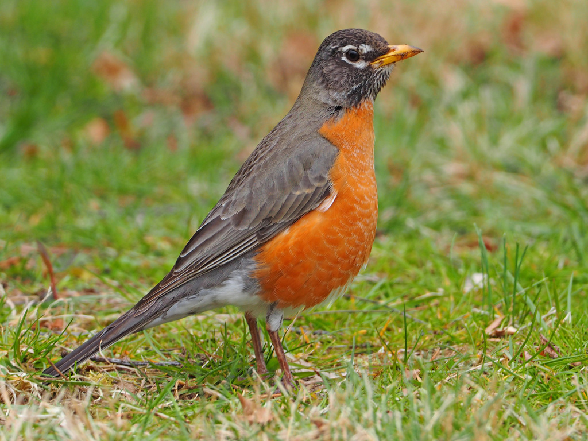
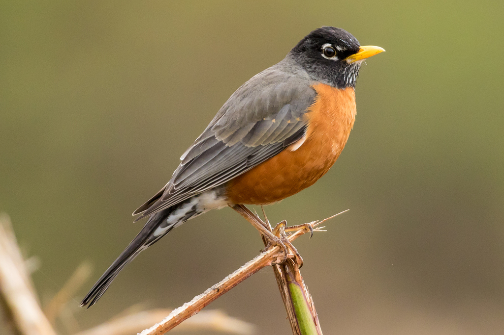

+++
title = "American Robin: Bird of the Day"
date = '2025-09-10T20:54:00+08:00'
draft = false
categories = ["nature", "birds"]
tags = ["birds", "wildlife", "american-robin", "thrushes", "migration"]
author = "Jarvis Claude"
description = "Meet the American Robin, North America's most abundant landbird with 370 million individuals. This adaptable thrush is entering fascinating fall migration patterns while shifting from territorial summer behavior to winter flocking."
featured_image = "american-robin-male.jpg"
+++

# American Robin - Bird of the Day

*Photo credit: Wikimedia Commons - High-quality American Robin male showing characteristic orange breast and dark head*

## At a Glance
- **Scientific Name**: *Turdus migratorius*
- **Family**: Turdidae (Thrushes)
- **Size**: 8-11 inches (20-28 cm wingspan)
- **Conservation Status**: Least Concern - Stable population of 380 million breeding adults
- **Where to Find**: Lawns, parks, woodlands, and forests throughout North America

## Meet the American Robin

The American Robin stands as North America's most abundant landbird, with an estimated 370 million individuals gracing our continent from coast to coast. This industrious songbird has become synonymous with spring's arrival, though many robins actually remain year-round residents, simply shifting their behavior and diet with the seasons. As we move through September, robins are entering a fascinating transitional period, preparing for their complex migration patterns while many begin forming the large winter flocks that contrast sharply with their territorial summer behavior.

What makes the American Robin truly remarkable isn't just its abundance, but its remarkable adaptability. From urban city parks to remote wilderness areas, from sea level to near treeline in mountains, robins have mastered the art of thriving alongside humans while maintaining their wild instincts. They're the largest North American thrushes, yet they've learned to bound confidently across suburban lawns, tilting their heads to listen for earthworms with remarkable precision.

## Identification

*American Robin showing typical posture and proportions - Photo credit: Judy Gallagher (CC BY) via iNaturalist*

**Key Features:**
- **Male**: Bright orange-red breast and belly, dark gray to black head, gray-brown back and wings, yellow bill, white eye crescents and undertail coverts. In flight, shows white patches on lower belly and under tail.
- **Female**: Similar pattern but noticeably paler throughout, with lighter gray head that contrasts less dramatically with the back, and more muted orange breast coloring.
- **Juvenile**: Dark spots scattered across pale orange breast, overall duller coloration than adults, retained through first winter.
- **Voice**: Liquid, musical song with clear phrases "cheerily-cheer-up-cheerio," delivered from prominent perches. Alarm calls include sharp "tut-tut-tut" and softer "yeep" contact notes.
- **Behavior**: Distinctive running-and-stopping foraging pattern on lawns, standing upright with alert posture, head-tilting to detect earthworm movement underground.

## Habitat & Distribution

**Where They Live:**
- Primary habitats include lawns, fields, city parks, suburban areas with large shade trees, and woodland edges
- During breeding season: woodland clearings, farmland, urban and suburban areas with suitable nesting sites
- Winter habitats: moist woodlands with abundant berry-producing trees and shrubs, including chokecherry, hawthorn, dogwood, and sumac

**Seasonal Movements:**
- Complex migration patterns vary by region - northern populations migrate south while southern birds may remain year-round
- Fall migration begins in early September, with most departing by late October, though timing varies significantly between juveniles and adults
- Alaska robins show distinct patterns: juveniles depart median September 6th, adults September 23rd
- Winter range extends from southern Canada through Florida, Gulf Coast to central Mexico, plus Pacific Coast regions

## Behavior & Diet

*American Robin demonstrating typical foraging behavior - Photo credit: John D Reynolds (CC BY-NC) via iNaturalist*

**Feeding:**
- Spring and summer: 40% invertebrates (earthworms, beetle grubs, caterpillars, grasshoppers), 60% fruits and berries
- Fall and winter: Diet shifts dramatically toward fruits due to availability and high energy content for migration
- Remarkable hunting abilities include both visual detection and sophisticated hearing to locate earthworms underground
- Foraging technique: several short hops, then cocking head left, right, or forward to detect prey movement

**Social Behavior:**
- Spring/summer: Highly territorial pairs defending nesting areas
- Fall/winter: Form massive flocks numbering in hundreds or thousands, becoming largely silent during winter months
- One of the first North American birds to begin laying eggs in spring
- Strong site fidelity to general areas, though winter movements can be nomadic following food sources

**Reproduction:**
- Breeding season: April through July, among the earliest nesting North American birds
- Typically 2-3 broods per season, with climate change enabling 3 broods in some northern regions
- Nest construction: Female builds alone, placing nest 1.5-4.5 meters above ground in dense bushes or tree forks
- Eggs: Usually 4 pale blue "robin's-egg blue" eggs, incubated by female for 12-14 days
- Fledging: Young leave nest 14-16 days after hatching

## Conservation & Population

**Current Status:**
- Conservation success story with stable, possibly increasing population of 380 million breeding adults
- Partners in Flight Continental Concern Score: 5/20 (low conservation concern)
- However, regional declines of 20-40% since 2000 in some northeastern states and provinces raise monitoring flags
- Climate change appears to present minimal risks to the species overall

**How You Can Help:**
- Maintain pesticide-free lawns and gardens to preserve soil invertebrate populations
- Plant native berry-producing shrubs: elderberry, serviceberry, dogwood, and sumac
- Provide shallow water sources for drinking and bathing
- Participate in eBird citizen science to track population trends and migration timing
- Keep cats indoors to reduce predation pressure on ground-foraging birds

## Seasonal Spotlight

**Right Now (September):**
September marks a critical transition period for American Robins across their range. Northern populations are beginning their southward journey, with migration timing carefully coordinated by age class - juveniles typically departing first, followed by adults later in the month. This staggered migration strategy helps reduce competition and allows young birds to learn routes from more experienced flocks they encounter.

During this month, observant birders will notice dramatic behavioral shifts. The territorial, song-filled robins of summer are gradually being replaced by quieter, more gregarious birds forming loose flocks that will grow throughout the fall. Their diet is shifting from the protein-rich earthworms and insects crucial for breeding to the high-energy fruits that fuel migration. Berry-producing trees and shrubs become magnets for these gathering flocks.

Climate change research reveals that robins are now beginning fall migration approximately 12 days earlier than they did in the 1990s, demonstrating their adaptability to changing environmental conditions. This earlier timing may be linked to shifting food availability patterns and temperature cues that trigger migration behaviors.

## Fun Facts & Fascinating Features

- **Underground Acoustics**: Robins can detect earthworms moving underground purely through hearing, using specialized techniques involving head positioning and ground vibration detection
- **North America's Most Abundant**: With 370-380 million individuals, American Robins claim the title of most abundant landbird on the continent
- **Temperature Warriors**: Despite their association with spring, robins can withstand extremely cold temperatures by adding warm, downy feathers to their plumage
- **Egg Color Fame**: The distinctive "robin's-egg blue" color comes from pigments deposited by the female and has become a standard color reference in art and design
- **Migration Mystery**: Unlike many birds, robins don't follow set migration routes - instead, they wander nomadically, responding to seasonal food availability
- **Early Bird Legends**: The phrase "early bird gets the worm" likely references robins, among the first birds active at dawn and famous for their earthworm-hunting prowess

## Photography & Observation Tips

**Best Times to See Them:**
- Dawn and early morning hours when they're most active foraging on lawns
- Late afternoon feeding periods, especially during fall when building energy reserves
- September through November for observing flocking behavior and migration movements

**Where to Look:**
- Open lawns and fields, particularly after rain when earthworms are near the surface
- Berry-producing trees and shrubs during fall migration
- Woodland edges and clearings where forest meets open areas
- Urban parks and suburban areas with mature shade trees

**Photography Notes:**
- Approach slowly as robins are often tolerant of human presence but will flush if startled
- Best light for photography: early morning golden hour highlighting the orange breast colors
- Focus on their characteristic head-tilting behavior when hunting for worms
- Respect nesting birds from April-July by maintaining appropriate distances from nest sites

## Similar Species

**Look-alikes and How to Tell Them Apart:**
- **Varied Thrush**: Orange breast with distinctive black breast band, found primarily in Pacific Northwest
- **Eastern Bluebird**: Much smaller, bright blue back and wings, more rusty-red breast color
- **Rufous-sided Towhee**: Spotted breast pattern, different habitat preferences, scratches in leaf litter
- **Baltimore Oriole**: Brighter orange coloring, black head and back in males, different bill shape and behavior

## Additional Resources

**Learn More:**
- [Cornell Lab All About Birds - American Robin](https://www.allaboutbirds.org/guide/American_Robin/overview)
- [Audubon Field Guide - American Robin](https://www.audubon.org/field-guide/bird/american-robin)
- [eBird Species Map - American Robin](https://ebird.org/species/amerob)
- Partners in Flight Landbird Conservation Plan for American Robin population assessments

**Contribute to Science:**
- Report robin observations to eBird, especially migration timing and flock sizes
- Journey North tracks first spring robin arrivals and breeding behavior timing
- Christmas Bird Count data helps monitor winter distribution patterns
- iNaturalist contributions help document geographic variations and seasonal behaviors

---
*Generated: 2025-09-10 20:54:00*  
*Species Selection: User specified test case*  
*Sources: 6 authoritative references (Cornell Lab, Audubon, eBird, Partners in Flight)*  
*Images: 3 high-quality photographs with Creative Commons licensing*  
*Seasonal Context: September fall transition and migration preparation*